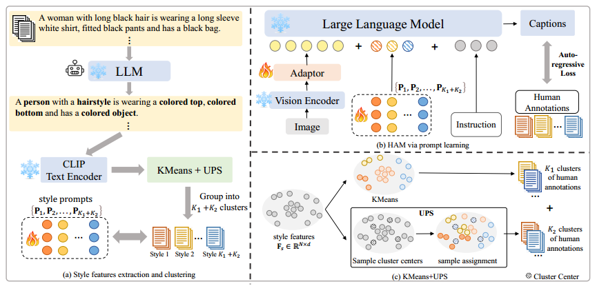

## Modeling Thousands of Human Annotators for Generalizable Text-to-Image Person Re-identification（CVPR25）

<!-- ### Introduction
This is the Pytorch implementation for M<sup>3</sup>L. -->



### Requirements

Our environment configuration is largely consistent with that of [LLaVA](https://github.com/haotian-liu/LLaVA).
1. Install Package
```Shell
conda create -n ham python=3.10 -y
conda activate ham
pip install -e .
```

2. Install additional packages for training cases
```
pip install -e ".[train]"
pip install flash-attn --no-build-isolation
```

3. Download the local transformer
```
cd ./transformers-4.31.0
pip install -e .
```

### 1、Train LLaVA with style prompts
- The instruction datas for training the LLaVA-1.6 are built on CUHK-PEDES and ICFG-PEDES and released at [here](https://pan.baidu.com/s/1y5v1aGyOp3ytCmfy0Q8Lfw?pwd=4y71).
- Replace the '-data_path' in './scripts/v1_5/finetune_task.sh' and run this .sh file to train the LLaVA with style prompts for image captioner.

### 2、Generate diverse captions for pedestrians images
- Prepare the SYNTH-PEDES images from [here](https://github.com/Zplusdragon/PLIP).
- Replace the checkpoint path in caption.py and run this file.
- We have also released our HAM-PEDES dataset at [./HAM_data/HAM_PEDES](https://pan.baidu.com/s/1y5v1aGyOp3ytCmfy0Q8Lfw?pwd=4y71), which consists of 2 captions per image for 1 million images, generated using the LLaVA1.6 model trained with our HAM method.

### 3、Train ReID model with our dataset
- We train the ReID model (CLIP-ViT-B/16) based on the [IRRA](https://github.com/anosorae/IRRA) code and our dataset, retaining only the SDM loss. Then we can get the ReID Pretrain model.
- After the model training is completed and evaluated on CUHK-PEDES, ICFG-PEDES and RSTPReid, it provide the performance of direct transfer setting in our paper.
- We have also release our ReID Pretrain model at [Baiduyun](https://pan.baidu.com/s/19xKmnYNV-XwK9FNcjkQmLw?pwd=bo63).

### 4、Finetune on downstream dataset based on other methods（e.g., IRRA, RDE）
- Initialize the model weights with our ReID pretrained model and reduce the learning rate by half.

### Acknowledgments
This repo borrows partially from [LLaVA](https://github.com/haotian-liu/LLaVA).

### Citation
```
@article{jiang2025modeling,
  title={Modeling Thousands of Human Annotators for Generalizable Text-to-Image Person Re-identification},
  author={Jiayu Jiang, Changxing Ding, Wentao Tan, Junhong Wang, Jin Tao, Xiangming Xu},
  journal={CVPR},
  year={2025},
}
```

### Contact
Email: 272521211@qq.com


